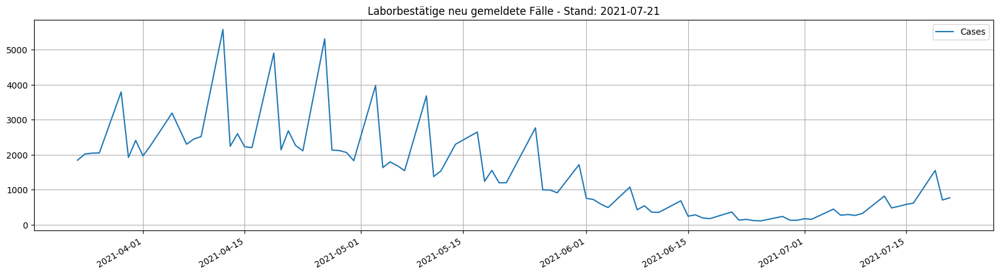
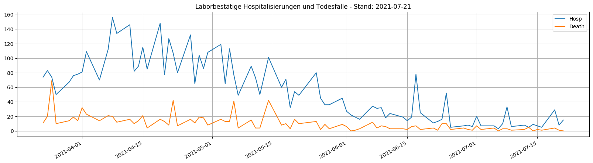

# Covid19CH

My code for analysis covid19-data of Switzerland.

## PythonAnywhere

Create a beginner account on [pythonanywhere.com](https://www.pythonanywhere.com/) to schedule a python-script, create a mysql-database, and create a website on your account.

### Python script

The Python script scrapp the API for the dayli newl laboratory-⁠confirmed cases, laboratory-⁠confirmed hospitalisations and laboratory-⁠confirmed deaths and save it into the mysql-database. This script sends also an message to discord with this data.
The script creates two charts of the data based on the mysql-database and save it to the website.

## Mysql database

There is one database with one table, where the dayli cases are stored.

## Website

There is one flask-based web app hosted on the beginner account, this app only display the two charts with the covid-statistics of Switzerland.

## Example of dayli overview

Die Pieks in der Grafik stammen von Nachmeldungen oder von den Wochenenden, das BAG veröffentlicht Daten nur von Montag bis Freitag.

Aktuelle Charts: [tinuwalther.pythonanywhere.com](https://tinuwalther.pythonanywhere.com/)

Quellen: [Federal Office of Public Health FOPH | Bundesamt für Gesundheit BAG](https://www.covid19.admin.ch/en/overview?ovTime=total)